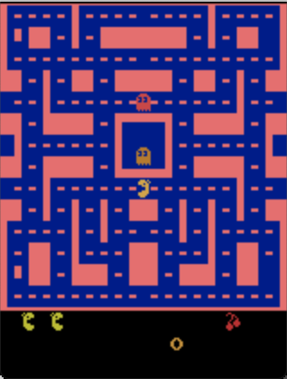
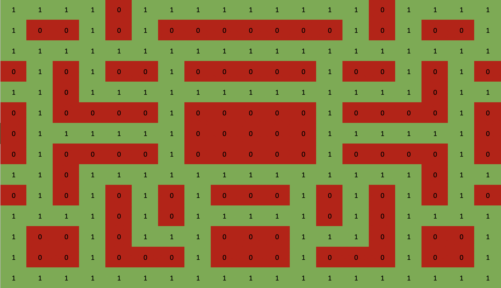

# ai-pacman
CSCI 4511W Final Project. Uses various search algorithms to optimize for score, navigating Ms. Pacman towards points and away from ghosts.

Many of the search algorithms used are provided in [_Artificial Intelligence: A Modern Approach_](http://aima.cs.berkeley.edu/)

